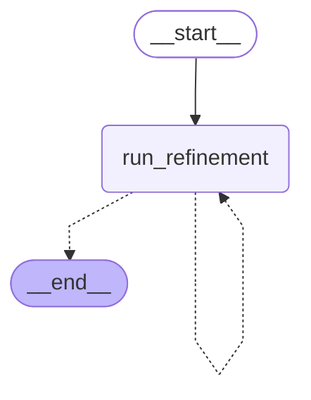
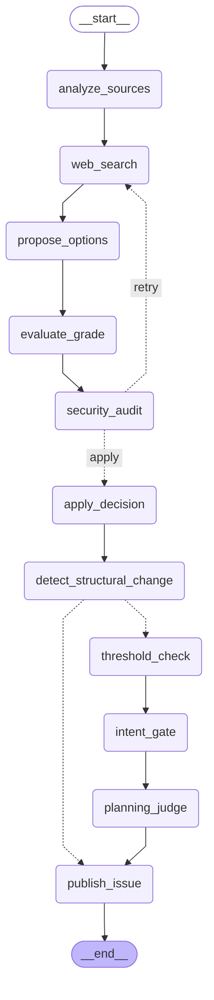

# How agentic-planner-core Works (End-to-End)

This document is the canonical reference for the **end-to-end behavior** of
`agentic-planner-core`: the three planning phases, the refinement LangGraph and
its nodes, every CLI command and flag, and the safety/quality gates that guard
the pipeline. It complements the [README](../README.md) (setup) and the
per-phase guides under [`docs/guides/`](./guides/).

> The README covers installation and the high-level flow. This page documents
> *how* the system behaves once it runs — including the CLI options and safety
> gates that surprise first-time users.

---

## Table of Contents

- [The Three Phases](#the-three-phases)
- [CLI Reference](#cli-reference)
- [Phase 3: The Refinement Graph](#phase-3-the-refinement-graph)
  - [Master Graph](#master-graph)
  - [Refinement Subgraph](#refinement-subgraph)
  - [Node-by-Node Flow](#node-by-node-flow)
- [Safety & Quality Gates](#safety--quality-gates)
- [The HITL Publish Gate](#the-hitl-publish-gate)
- [Configuration Reference](#configuration-reference)
- [Edge Cases & Startup Abort Conditions](#edge-cases--startup-abort-conditions)
- [Further Reading (ADRs)](#further-reading-adrs)

---

## The Three Phases

The planner is an **autonomous planning and issue refinement orchestrator**. It
turns a vague project intent into detailed, researched, ADR-compliant GitHub
issues in three phases, all executed centrally from this repository. The target
repository stays clean of any `.planner/` machinery.

| Phase | Command | Skill | What happens | Output |
|---|---|---|---|---|
| **1 — Interactive Design** | `python -m planner grill` | `grill-with-docs` | A LangChain `deepagents` agent interviews the developer to create/refine `PRD.md`, `CONTEXT.md` (Domain Glossary), and `docs/adr/*` **in the target repository**. | PRD, glossary, ADRs in target repo |
| **1b — Learning Verification** | `python -m planner verify` | `wise-teacher` | Interactive learning session confirming deep understanding of the design; logs a checklist. | `.planner/drafts/<repo>/.teaching-checklist.md` |
| **2 — Draft Issue Generation** | `python -m planner draft` | `draft-issues` | Splits the PRD into topologically sorted, tracer-bullet **vertical slices** written as Markdown **Draft Issues**. | `.planner/drafts/<repo>/####-slug.md` |
| **3 — Autonomous Refinement & Publish** | `python -m planner refine` | (LangGraph) | A master orchestrator iterates over every Draft Issue, running an isolated Refinement Subgraph per issue (search, grading, security audit, rewrite), then publishes it to GitHub. | `agent-ready` GitHub issues |

Phases 1–2 are **interactive** (human-in-the-loop). Phase 3 is **autonomous**:
each draft is refined in a contextually isolated subgraph so research from one
issue never leaks into another (prevents "context rot" — see
[ADR-0001](./adr/0001-drei-separate-graphen.md) and
[ADR-0005](./adr/0005-master-loop-and-issue-publishing-in-subgraph.md)).

---

## CLI Reference

### Commands

| Command | Purpose |
|---|---|
| `python -m planner grill` | Interactive PRD/ADR design session (Phase 1) |
| `python -m planner verify` | Learning verification checklist (Phase 1b) |
| `python -m planner draft` | Generate draft issues from the PRD (Phase 2) |
| `python -m planner refine` | Autonomous refinement & publish (Phase 3) |
| `python -m planner eval --judge <type>` | LLM-Judge regression eval suite |

### `refine` options

| Flag | Default | Description |
|---|---|---|
| `--config <path>` | `config/sources.toml` | Path to the sources configuration file. |
| `--zero-tolerance` | off | Enable the Zero-Error-Tolerance Validation AddOn: deterministic glossary, dependency-DAG, and ADR-traceability lints plus an Intent Gate and Planning Judge. Any violation halts the batch (HITL). See [ADR-0019](./adr/0019-zero-tolerance-validation-addon.md). |
| `--interactive` | off | Force the HITL publish gate **on**: prompt for confirmation before each GitHub issue is created. Overrides `[security].require_approval = false`. See [ADR-0020](./adr/0020-zero-trust-prompt-injection-defense.md). |
| `--yes` | off | Auto-approve the HITL publish gate for every issue, even when `[security].require_approval = true`. Use in CI / autonomous runs. |

### `grill` / `verify` options

| Flag | Description |
|---|---|
| `--session-id <id>` | Explicit session ID to resume an existing grill/verify session. |

### `eval` options

| Flag | Default | Description |
|---|---|---|
| `--judge <type>` | *(required)* | Judge type to evaluate: `syntax_lint`, `test_coverage`, `architecture`, `security`. (`evaluate_grade` is a placeholder — see [ADR-0017](./adr/0017-evaluate-grade-excluded-from-binary-eval-harness.md).) |
| `--model <id>` | *(from `config/factory.json`)* | OpenRouter model id overriding the factory config for this run. |
| `--fixtures-dir <path>` | `tests/eval/fixtures` | Directory holding the gold-standard fixtures. |
| `--results-json <path>` | `results.json` | Path to write the `results.json` artifact. |

---

## Phase 3: The Refinement Graph

Phase 3 is implemented as **two LangGraph graphs** ([ADR-0001](./adr/0001-drei-separate-graphen.md)):

1. A **Master Graph** that loops over every draft issue.
2. A **Refinement Subgraph** that runs once per draft, in isolation.

The diagrams below are the exact graphs produced by LangGraph's own
`get_graph().draw_mermaid()` — the same visualization primitive the LangGraph
documentation recommends for documenting compiled graphs.

### Master Graph



The master graph has a single node, `run_refinement`, and a conditional edge
(`should_continue`). While `current_issue_index < len(draft_issues)` it loops
back to `run_refinement`; otherwise it ends. Each iteration invokes the
Refinement Subgraph for one draft.

**Per-draft isolation ([ADR-0005](./adr/0005-master-loop-and-issue-publishing-in-subgraph.md)):**
a single draft failure is isolated — it is recorded in `failed_drafts` (the
draft stays on disk for a rerun) and the batch continues. The terminal batch
status is derived from the accumulated `succeeded_drafts` / `failed_drafts`
lists rather than an overwriteable `status` field, so a partial run is reported
honestly.

**Zero-Error-Tolerance exception ([ADR-0019](./adr/0019-zero-tolerance-validation-addon.md)):**
a `ZeroToleranceViolation` HALTS the entire batch immediately (HITL) instead of
being isolated per-draft.

### Refinement Subgraph



### Node-by-Node Flow

The linear backbone with its two conditional branches:

```
analyze_sources → web_search → propose_options → evaluate_grade
  → security_audit → apply_decision → detect_structural_change
  → (threshold_check → intent_gate → planning_judge) → publish_issue
```

| Node | Responsibility | Key ADR |
|---|---|---|
| `analyze_sources` | Inspect the draft and the target repo to extract search keywords/queries. | — |
| `web_search` | Run targeted web/GitHub search, restricted to the source allowlist when `strict: true`. On a security retry it re-runs in **filter-only mode** (drops blacklisted sources, no re-fetch). | [ADR-0002](./adr/0002-strict-modus-quelleneinschraenkung.md) |
| `propose_options` | List candidate design options for the issue (generator). | — |
| `evaluate_grade` | An LLM-as-a-Judge scores each option against `config/grading_rubric.md` and existing ADRs, returning structured Pydantic grades (critic). Follows the Generator–Critic pattern. | — |
| `security_audit` | Zero-Trust prompt-injection check on every externally-sourced document. On detection: blacklist the source and route `retry` → `web_search`. After `max_security_retries`, fall back to offline refinement. | [ADR-0020](./adr/0020-zero-trust-prompt-injection-defense.md) |
| `apply_decision` | Apply the winning graded option: rewrite the draft into an implementation-ready issue. | — |
| `detect_structural_change` | Deterministically compare the refined draft's structural signature against the original. Drives the Cascade Collision Gate. | [ADR-0019](./adr/0019-zero-tolerance-validation-addon.md) |
| `threshold_check` | Zero-tolerance gate: enforce `min_acceptable_score`, fruitless-search budget, and the triviality fast-path. | [ADR-0019](./adr/0019-zero-tolerance-validation-addon.md) |
| `intent_gate` | Semantic gate: generate an `INTENT:` line and check that the draft's assumptions, the target system's actual state, and the spec (PRD/Glossary/ADR) agree. A mismatch ("Surprise") halts the process. | [ADR-0019](./adr/0019-zero-tolerance-validation-addon.md) |
| `planning_judge` | Final adversarial audit: treat the refined issue as a hypothesis and test it against the spec. A negative verdict halts the process. The judge only evaluates — it never rewrites. | [ADR-0019](./adr/0019-zero-tolerance-validation-addon.md) |
| `publish_issue` | Extract title/body, ensure the `agent-ready` label, run the HITL publish gate, and create the GitHub issue. | [ADR-0005](./adr/0005-master-loop-and-issue-publishing-in-subgraph.md), [ADR-0020](./adr/0020-zero-trust-prompt-injection-defense.md) |

#### The two conditional branches

1. **`security_audit` → `route_after_audit`**: returns `"retry"` (re-enter
   `web_search` in filter-only mode to drop blacklisted sources) or `"apply"`
   (proceed to `apply_decision` — clean, or offline fallback after exhausting
   retries).

2. **`detect_structural_change` → `route_after_decision`**: in
   non-zero-tolerance mode **or** for a trivial draft, route straight to
   `publish_issue` (skip the LLM gates to save cost — the Triviality Gate,
   [ADR-0019](./adr/0019-zero-tolerance-validation-addon.md)). Otherwise route
   to `threshold_check` → `intent_gate` → `planning_judge`.

#### Cascade Collision Gate (zero-tolerance only)

If a draft was structurally changed during refinement, its **downstream
dependents** in the dependency DAG are marked `stale` and skipped for the
remainder of this run. Stale drafts stay on disk for a human-driven rerun. A
structural change means a change in section structure, scope, or dependency
relationships — *not* a rewording.

---

## Safety & Quality Gates

The pipeline is guarded by a layered set of deterministic and semantic gates.
Their ordering matters: cheaper deterministic checks run first.

| Gate | When | Behavior | ADR |
|---|---|---|---|
| **Strict source allowlist** | `web_search` (and Direct-URL / GitHub-API tools) | When `strict: true`, search/fetch is restricted to `allowed_domains`. Startup aborts if strict is on but the allowlist is empty. | [ADR-0002](./adr/0002-strict-modus-quelleneinschraenkung.md) |
| **GitHub API quota check** | `refine` startup | Aborts before the loop if remaining rate limit < `max(50, num_drafts * 3)`. | — |
| **Zero-Error-Tolerance batch gate** | `refine` startup, before the loop (when `--zero-tolerance`) | Runs deterministic glossary, dependency-DAG, and ADR-traceability lints over all drafts. Any ERROR halts the batch immediately (HITL). | [ADR-0019](./adr/0019-zero-tolerance-validation-addon.md) |
| **Security audit (self-healing)** | After `evaluate_grade`, before `apply_decision` | LLM Security Judge + regex pre-filter inspect externally-sourced docs. On detection: blacklist the source and retry `web_search` in filter-only mode. After `max_security_retries`: fall back to offline refinement. | [ADR-0020](./adr/0020-zero-trust-prompt-injection-defense.md) |
| **Intent Gate** | Before publish (non-trivial, zero-tolerance) | Asserts draft assumptions ↔ target-system state ↔ spec agree. | [ADR-0019](./adr/0019-zero-tolerance-validation-addon.md) |
| **Planning Judge** | Before publish (non-trivial, zero-tolerance) | Adversarial semantic audit of the refined issue. | [ADR-0019](./adr/0019-zero-tolerance-validation-addon.md) |
| **HITL publish gate** | `publish_issue`, before the GitHub API call | Prompts for human confirmation per issue. See [below](#the-hitl-publish-gate). | [ADR-0020](./adr/0020-zero-trust-prompt-injection-defense.md) |
| **Per-draft wall-clock budget** | Each subgraph invocation | A hard SIGALRM deadline (default `1800s`, env `REFINE_DRAFT_BUDGET_S`) interrupts an in-flight blocking LLM call. A timed-out draft is isolated like any per-draft failure. | [ADR-0021](./adr/0021-robuste-llm-timeout-durchsetzung.md) |
| **LLM-Judge PR review** | CI, on pull requests (`scripts/review.py`) | Multi-stage binary PR judges (`syntax_lint`, `test_coverage`, `architecture`, `security`) whose FAIL/NEEDS-REVIEW verdicts are merge-blocking. | [ADR-0008](./adr/0008-multistage-llm-pr-judges.md), [ADR-0014](./adr/0014-llm-judge-merge-blocking.md), [ADR-0015](./adr/0015-hidden-verdict-block.md) |

---

## The HITL Publish Gate

The publish gate is the most common source of surprise for first-time users.
It is controlled by three signals that resolve to a single boolean,
`require_approval`:

| Signal | Effect |
|---|---|
| `[security].require_approval = true` (in `config/sources.toml`) | Gate **on** by default. |
| `--interactive` (CLI flag) | Force gate **on**, overriding `require_approval = false`. |
| `--yes` (CLI flag) | Force gate **off** (auto-approve every issue), even when `require_approval = true`. Use in CI / autonomous runs. |

Resolution order in `refine`:
`require_approval` ← config value; then `--interactive` sets it `True`; then
`--yes` sets it `False`. So `--yes` wins over `--interactive`.

**Non-interactive environments:** if the gate is enabled but `stdin` is not a
TTY (e.g. CI), the gate **auto-approves with a warning** so CI runs neither
hang nor crash. The same applies on `EOF` at the prompt.

When the gate prompts, it prints the proposed issue (title + body) and a
unified diff of the refinement, then asks `Publish this issue to GitHub? [y/N]`.

> **Note:** `agent_logs/review.log` is written **only** by `scripts/review.py`
> (the CI PR judges), never by the `refine` CLI. Do not use it to debug a
> refine run. Refine-side security findings are written to a per-run Markdown
> report under `.planner/reports/<repo>/`.

---

## Configuration Reference

### `config/sources.toml` (search sources, security, zero-tolerance — [ADR-0016](./adr/0016-sources-config-yaml-to-toml.md))

```toml
strict = true                         # restrict search/fetch to the allowlist
urls = ["https://github.com/langchain-ai/langgraph"]
domains = ["arxiv.org"]

[search]
engine = "auto"                       # "auto" | "exa" | ...
search_context_size = "medium"        # short | medium | long
max_results = 5                       # per-query limit
max_total_results = 15                # total limit
excluded_domains = ["reddit.com"]

# Zero-Trust Prompt-Injection Defense (ADR-0020).
# Defense ranking: strict allowlist + LLM Security Judge + HITL publish gate
# are PRIMARY; sanitize_inputs (regex) is a best-effort pre-filter only.
[security]
sanitize_inputs = true
audit_level = "normal"                # "off" | "normal" | "strict"
require_approval = true               # HITL publish gate default
max_security_retries = 2

# Zero-Error-Tolerance Validation AddOn (ADR-0019).
# All fields optional; enabled via --zero-tolerance or enabled = true here.
[zero_tolerance]
enabled = false
min_acceptable_score = 5.0
max_fruitless_searches = 0
trivial_max_lines = 15
trivial_scopes = ["docs"]
context_path = "CONTEXT.md"
adr_dirs = ["docs/adr", "docs/agdr"]
```

### `config/factory.json` (per-node model + OpenRouter routing)

Defines the LLM model used by each refinement node and the OpenRouter routing.
Per-node models can be overridden by environment variables (see the README).

### Environment variables

| Variable | Purpose |
|---|---|
| `OPENROUTER_API_KEY` | LLM orchestration API key. |
| `GH_PAT` | GitHub Personal Access Token (read: contents, issues, releases). |
| `GITHUB_REPOSITORY` | Target repository, `owner/repo`. |
| `GITHUB_WORKSPACE` | Absolute (or `.workspaces/`-relative) path to the target repo. |
| `AGENT_MODEL` | Global fallback model (default `z-ai/glm-5.2`). |
| `GRILL_MODEL` / `VERIFY_MODEL` / `DRAFT_MODEL` | Per-phase model overrides. |
| `REFINE_*_MODEL` | Per-refinement-node model overrides (e.g. `REFINE_EVALUATE_GRADE_MODEL`). |
| `REFINE_DRAFT_BUDGET_S` | Per-draft wall-clock budget in seconds (default `1800`, `<= 0` disables). |
| `LANGFUSE_PUBLIC_KEY` / `LANGFUSE_SECRET_KEY` | Optional telemetry/tracing. |

---

## Edge Cases & Startup Abort Conditions

- **Empty allowlist + strict mode:** `refine` aborts at startup with
  `Strict-mode is enabled ... but allowed_domains is empty`.
- **Insufficient GitHub quota:** `refine` aborts at startup if remaining rate
  limit < `max(50, num_drafts * 3)`.
- **Zero-Error-Tolerance batch failure:** the deterministic batch gate halts
  the whole run before the loop on any lint ERROR (HITL).
- **No drafts found:** `refine` prints `No draft issues found. Nothing to
  refine.` and exits cleanly.
- **Per-draft failure / timeout:** the draft is recorded in `failed_drafts`,
  left on disk for a rerun, and the batch continues (exit code `1` on a partial
  run).
- **Stale drafts (cascade):** structurally-changed drafts mark downstream
  dependents `stale`; those are skipped and left on disk for a rerun.
- **Security exhaustion:** after `max_security_retries`, the subgraph falls
  back to **offline refinement** (local ADRs only, external results discarded).

---

## Further Reading (ADRs)

| ADR | Topic |
|---|---|
| [0001](./adr/0001-drei-separate-graphen.md) | Separate phases instead of a monolithic graph |
| [0002](./adr/0002-strict-modus-quelleneinschraenkung.md) | Strict source restriction against prompt injection |
| [0005](./adr/0005-master-loop-and-issue-publishing-in-subgraph.md) | Master loop and issue publishing inside the subgraph |
| [0008](./adr/0008-multistage-llm-pr-judges.md) | Multi-stage LLM-as-a-Judge PR reviews |
| [0014](./adr/0014-llm-judge-merge-blocking.md) | LLM-Judge verdicts are merge-blocking |
| [0015](./adr/0015-hidden-verdict-block.md) | Hidden machine-readable verdict block in PR review |
| [0016](./adr/0016-sources-config-yaml-to-toml.md) | Sources config migrated YAML → TOML |
| [0017](./adr/0017-evaluate-grade-excluded-from-binary-eval-harness.md) | `evaluate_grade` excluded from the binary eval harness |
| [0019](./adr/0019-zero-tolerance-validation-addon.md) | Zero-Error-Tolerance Validation AddOn |
| [0020](./adr/0020-zero-trust-prompt-injection-defense.md) | Zero-Trust prompt-injection defense + HITL publish gate |
| [0021](./adr/0021-robuste-llm-timeout-durchsetzung.md) | Robust transport-level timeout enforcement for LLM calls |
