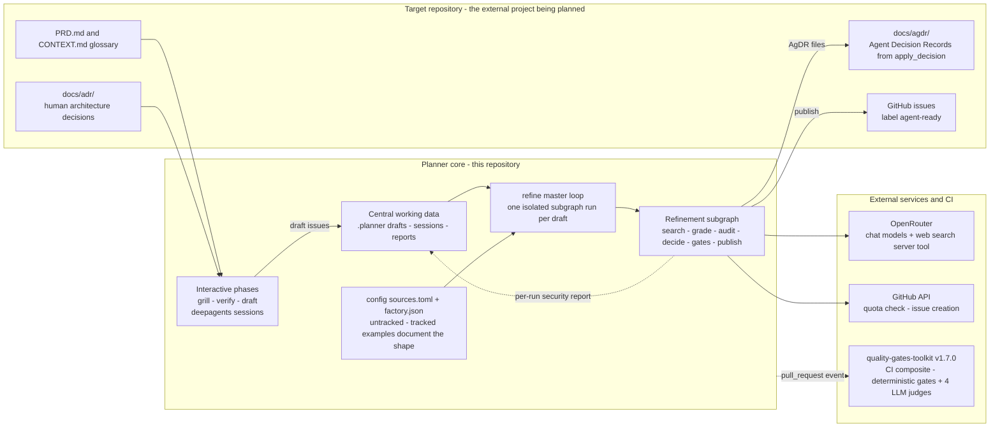

# Architecture overview — coarse component view

How the moving parts relate: the planner core (this repository), the target
repository it plans for, and the external services and CI quality gates around
them. Node-level behavior is detailed in the sibling views and in
[architecture.md](../architecture.md).

> **Reflects:** behavior on `main` as of 2026-09-12. Grounded in the sources
> below; where an ADR and the code disagree, this diagram follows the code and
> the mismatch is flagged under **Sources**.

## Diagram

## Notes

- Three graphs instead of one monolith (ADR-0001): interactive phases and the
  autonomous refinement loop each get an isolated entrypoint and state; the
  filesystem is the only communication channel between phases.
- Strict-mode source restriction (ADR-0002) and the OpenRouter server-tools
  binding (ADR-0003) live inside the subgraph's search path — detailed in
  [detailed-search-grounding.md](./detailed-search-grounding.md).
- AgDR/ADR path separation (ADR-0004): human decisions go to `docs/adr/`,
  agent-produced decisions to `docs/agdr/` in the target repository — the
  planner core itself stays free of target-repo planning files.
- CI judges (ADR-0008, consumed from the toolkit per ADR-0022) review this
  repository's own pull requests — detailed in
  [detailed-judges.md](./detailed-judges.md).
- Per-draft wall-clock budget: a SIGALRM deadline (default `1800` s, env
  `REFINE_DRAFT_BUDGET_S`) interrupts an in-flight LLM call; a timed-out draft
  is isolated like any per-draft failure (ADR-0021).

## Sources

- Graph wiring: [../../planner/refine_graph.py](../../planner/refine_graph.py)
- CLI surface: [../../planner/__main__.py](../../planner/__main__.py)
- CI caller: [../../.github/workflows/pr-checks.yml](../../.github/workflows/pr-checks.yml)
- ADR-0001 — separate phases:
  [../adr/0001-drei-separate-graphen.md](../adr/0001-drei-separate-graphen.md)
- ADR-0002 — strict-mode source restriction:
  [../adr/0002-strict-modus-quelleneinschraenkung.md](../adr/0002-strict-modus-quelleneinschraenkung.md)
- ADR-0003 — OpenRouter server-tools binding:
  [../adr/0003-openrouter-server-tools-binding.md](../adr/0003-openrouter-server-tools-binding.md)
- ADR-0004 — structured AgDR and path separation:
  [../adr/0004-structured-agdr-and-path-separation.md](../adr/0004-structured-agdr-and-path-separation.md)
- ADR-0008 — multistage LLM PR judges:
  [../adr/0008-multistage-llm-pr-judges.md](../adr/0008-multistage-llm-pr-judges.md)
- ADR-0022 — consume quality-gates-toolkit:
  [../adr/0022-consume-quality-gates-toolkit.md](../adr/0022-consume-quality-gates-toolkit.md)
- ADR-0024 — untracked personal configuration:
  [../adr/0024-forward-only-secret-policy-and-untracked-config.md](../adr/0024-forward-only-secret-policy-and-untracked-config.md)
