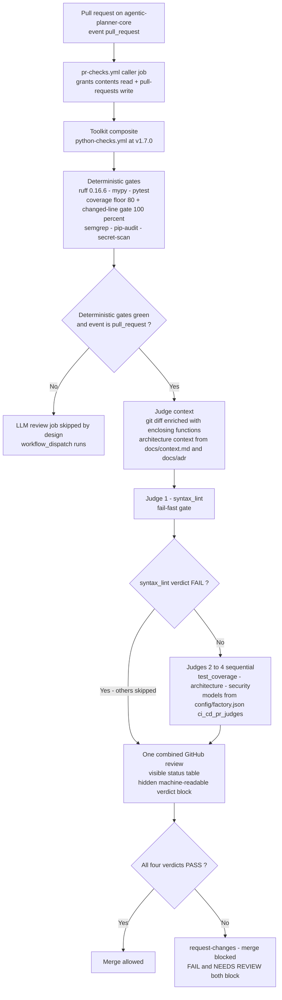

# Detailed view — the CI LLM-judge pipeline

How pull requests on this repository are judged: the toolkit composite runs
deterministic gates first, then four sequential LLM judges whose verdicts are
merge-blocking.

> **Reflects:** behavior on `main` as of 2026-09-12. Grounded in the sources
> below; where an ADR and the code disagree, this diagram follows the code and
> the mismatch is flagged under **Sources**.

## Diagram

## Notes

- Judge models resolve solely from `config/factory.json` (key
  `ci_cd_pr_judges`); on a fresh clone the file is untracked and missing, and
  the toolkit falls back to its built-in default models (ADR-0024). Env-var
  model overrides exist only as documented exceptions.
- Fail-fast rationale (ADR-0008): a syntax failure skips the remaining judges
  (`SKIPPED`), so expensive reasoning models never run on syntactically broken
  code, and the review still lands immediately with `REQUEST_CHANGES`.
- Verdict semantics (ADR-0014): both `FAIL` and `NEEDS REVIEW` block the merge;
  only verified `PASS` verdicts allow it.
- The hidden verdict block (ADR-0015) is an HTML comment in the review body,
  consumed by the `pr-feedback-loop` parser — the visible table is for humans
  only.
- Calibration (ADR-0023): `planner/eval/judge.py` imports `JUDGE_PROMPTS`,
  `evaluate_response`, and `load_architecture_context` from
  `quality_gates_toolkit.review`, so the eval suite
  (`python -m planner eval --judge <type>`, ADR-0017) calibrates exactly what
  CI runs.

## Sources

- CI caller: [../../.github/workflows/pr-checks.yml](../../.github/workflows/pr-checks.yml)
- ADR-0008 — multistage LLM PR judges:
  [../adr/0008-multistage-llm-pr-judges.md](../adr/0008-multistage-llm-pr-judges.md)
- ADR-0011 — judge context strategy:
  [../adr/0011-judge-kontext-strategie.md](../adr/0011-judge-kontext-strategie.md)
- ADR-0014 — judge merge-blocking:
  [../adr/0014-llm-judge-merge-blocking.md](../adr/0014-llm-judge-merge-blocking.md)
- ADR-0015 — hidden verdict block:
  [../adr/0015-hidden-verdict-block.md](../adr/0015-hidden-verdict-block.md)
- ADR-0022 — consume quality-gates-toolkit:
  [../adr/0022-consume-quality-gates-toolkit.md](../adr/0022-consume-quality-gates-toolkit.md)
- ADR-0023 — importable toolkit judge API:
  [../adr/0023-replace-judge-snapshot-with-importable-toolkit-package.md](../adr/0023-replace-judge-snapshot-with-importable-toolkit-package.md)
- Factory shape: [../../config/factory.example.json](../../config/factory.example.json)
- Eval adapter: [../../planner/eval/](../../planner/eval/)

**Mismatch flagged:** ADR-0011, ADR-0014, and ADR-0015 cite `scripts/review.py`
as the judge engine; since ADR-0022/ADR-0023 the engine ships in the
`quality-gates-toolkit` package, CI consumes it via the composite workflow, and
the local `scripts/` directory no longer exists. The diagram follows the code.
