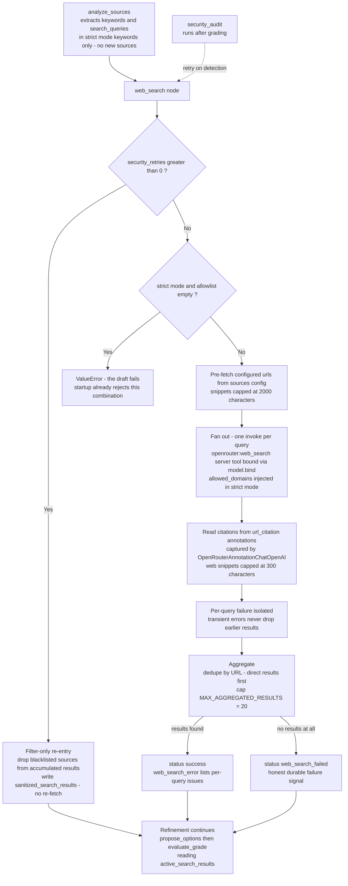

# Detailed view — search grounding and injection safety

Inside the refinement subgraph's research path: how queries fan out, how
results stay grounded in `url_citation` annotations, and how the zero-trust
defense handles flagged sources.

> **Reflects:** behavior on `main` as of 2026-09-12. Grounded in the sources
> below; where an ADR and the code disagree, this diagram follows the code and
> the mismatch is flagged under **Sources**.

## Diagram

## Notes

- Defaults (configurable in `config/sources.toml`): `strict = true`,
  `engine = "auto"`, `search_context_size`, `max_results`, `max_total_results`,
  `excluded_domains`. In strict mode the `allowed_domains` set is the merged
  set of configured `domains` plus the hosts of configured `urls`.
- Defense ranking (ADR-0020): the strict allowlist, the LLM security judge, and
  the HITL publish gate are PRIMARY; the regex pre-filter is best-effort only
  (logs in `normal` mode, contributes to blocking in `strict` mode).
- Self-healing loop: on detection the offending source is blacklisted and the
  graph re-enters `web_search` in filter-only mode — no re-fetch, because the
  same queries would return the same indexed source. After
  `max_security_retries = 2` or when no clean results remain, refinement falls
  back to offline mode (external results discarded, local ADRs only).
- The aggregate cap constant `MAX_AGGREGATED_RESULTS = 20` lives in
  `planner/nodes/web_search.py`; per-query results use the
  `Annotated[List, operator.add]` reducers so partial failures never silently
  drop earlier results.

## Sources

- ADR-0002 — strict-mode source restriction:
  [../adr/0002-strict-modus-quelleneinschraenkung.md](../adr/0002-strict-modus-quelleneinschraenkung.md)
- ADR-0003 — OpenRouter server-tools binding:
  [../adr/0003-openrouter-server-tools-binding.md](../adr/0003-openrouter-server-tools-binding.md)
- ADR-0010 — direct-URL and GitHub-API tools:
  [../adr/0010-direkt-url-und-github-api-werkzeuge.md](../adr/0010-direkt-url-und-github-api-werkzeuge.md)
- ADR-0012 — url_citation annotation capture:
  [../adr/0012-url-citation-annotation-capture.md](../adr/0012-url-citation-annotation-capture.md)
- ADR-0013 — per-query search fan-out:
  [../adr/0013-per-query-search-fanout.md](../adr/0013-per-query-search-fanout.md)
- ADR-0020 — zero-trust prompt-injection defense:
  [../adr/0020-zero-trust-prompt-injection-defense.md](../adr/0020-zero-trust-prompt-injection-defense.md)
- Node code: [../../planner/nodes/web_search.py](../../planner/nodes/web_search.py),
  tools: [../../planner/tools/research.py](../../planner/tools/research.py),
  analyzer: [../../planner/nodes/analyze_sources.py](../../planner/nodes/analyze_sources.py)
- Security report writer:
  [../../planner/nodes/security_audit.py](../../planner/nodes/security_audit.py)

**Mismatch flagged:** ADR-0010 documents a 10-entry cap on `search_results`;
the code and ADR-0013 cap the aggregate at `MAX_AGGREGATED_RESULTS = 20`
(`planner/nodes/web_search.py`). The diagram follows the code.
