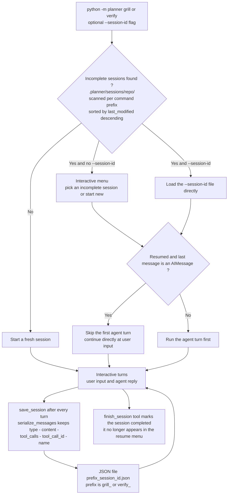

# Detailed view — session persistence and resuming

How the interactive commands (`grill`, `verify`) persist every conversation
turn to plain JSON and how an interrupted session is resumed.

> **Reflects:** behavior on `main` as of 2026-09-12. Grounded in the sources
> below; where an ADR and the code disagree, this diagram follows the code and
> the mismatch is flagged under **Sources**.

## Diagram

## Notes

- Custom serialization instead of library serialization (ADR-0006): plain
  stdlib `json` with an explicit field mapping (`type`, `content`,
  `tool_calls`, `tool_call_id`, `name`). The format is decoupled from
  LangChain-internal classes, so library upgrades cannot corrupt saved
  sessions; corrupt JSON files are ignored when scanning.
- The first-agent-turn skip (ADR-0007) prevents a redundant agent reaction
  (and its token cost) when the saved history already ends with an agent
  reply.
- `grill` and `verify` share exactly the same persistence and resume
  mechanism; the command type is encoded in the filename prefix
  (`grill_`, `verify_`).

## Sources

- ADR-0006 — custom JSON session serialization:
  [../adr/0006-custom-json-session-serialization.md](../adr/0006-custom-json-session-serialization.md)
- ADR-0007 — interactive session resuming:
  [../adr/0007-interactive-session-resuming.md](../adr/0007-interactive-session-resuming.md)
- Implementation: [../../planner/cli_planning.py](../../planner/cli_planning.py)
  (`serialize_messages`, `deserialize_messages`, `save_session`,
  `load_or_select_session`, `run_interactive_console_loop`)
- Glossary anchors (CONTEXT.md): *Sitzungs-Serialisierung (Session
  Serialization)*, *Grill-Session (Grill Session)* —
  [../../CONTEXT.md](../../CONTEXT.md)
