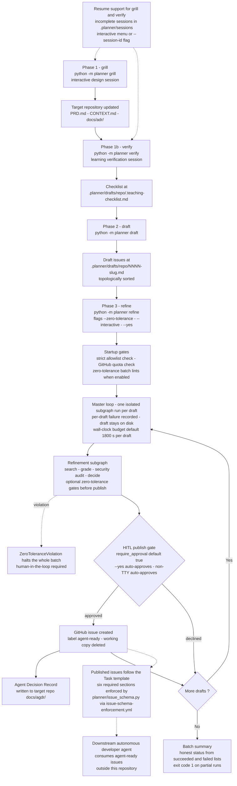

# Process — from project intent to agent-ready issues

The intended usage process across the three phases: interactive design
(grill), learning verification (verify), draft generation (draft), then the
autonomous refinement batch (refine) that publishes agent-ready GitHub issues.

> **Reflects:** behavior on `main` as of 2026-09-12. Grounded in the sources
> below; where an ADR and the code disagree, this diagram follows the code and
> the mismatch is flagged under **Sources**.

## Diagram

## Notes

- Phases 1, 1b, and 2 are interactive (human-in-the-loop); phase 3 is fully
  autonomous (ADR-0001). Phases communicate only through files: PRD, glossary,
  and ADRs live in the target repository; drafts, checklists, sessions, and
  reports live centrally under `.planner/` in the planner core.
- Per-draft isolation (ADR-0005): one draft failing never aborts the batch —
  only `ZeroToleranceViolation` does (ADR-0019 exception).
- The HITL publish gate (ADR-0020) is controlled by
  `[security].require_approval` (default `true`), forced on by `--interactive`,
  forced off by `--yes` (CI/autonomous runs). A non-TTY stdin auto-approves
  with a warning.
- Template enforcement (issue #39): issues created via the REST API are
  validated against `.github/ISSUE_TEMPLATE/task.yml`. A non-compliant body is
  labeled `invalid` and closed; a later compliant edit reopens it
  automatically.

## Sources

- Root README workflow overview: [../../README.md](../../README.md)
- End-to-end prose reference: [../architecture.md](../architecture.md)
- ADR-0001 — separate phases instead of a monolithic graph:
  [../adr/0001-drei-separate-graphen.md](../adr/0001-drei-separate-graphen.md)
- ADR-0004 — structured AgDR and path separation:
  [../adr/0004-structured-agdr-and-path-separation.md](../adr/0004-structured-agdr-and-path-separation.md)
- ADR-0005 — master loop and issue publishing inside the subgraph:
  [../adr/0005-master-loop-and-issue-publishing-in-subgraph.md](../adr/0005-master-loop-and-issue-publishing-in-subgraph.md)
- ADR-0006 / ADR-0007 — session serialization and resuming:
  [../adr/0006-custom-json-session-serialization.md](../adr/0006-custom-json-session-serialization.md),
  [../adr/0007-interactive-session-resuming.md](../adr/0007-interactive-session-resuming.md)
- ADR-0019 — zero-error-tolerance validation AddOn:
  [../adr/0019-zero-tolerance-validation-addon.md](../adr/0019-zero-tolerance-validation-addon.md)
- ADR-0020 — zero-trust prompt-injection defense and HITL publish gate:
  [../adr/0020-zero-trust-prompt-injection-defense.md](../adr/0020-zero-trust-prompt-injection-defense.md)
- CLI and startup gates: [../../planner/__main__.py](../../planner/__main__.py),
  graph wiring: [../../planner/refine_graph.py](../../planner/refine_graph.py),
  publish gate: [../../planner/nodes/publish_issue.py](../../planner/nodes/publish_issue.py)
- Template enforcement:
  [../../planner/issue_schema.py](../../planner/issue_schema.py),
  [../../.github/workflows/issue-schema-enforcement.yml](../../.github/workflows/issue-schema-enforcement.yml),
  guide: [../guides/issue-schema-enforcement.md](../guides/issue-schema-enforcement.md)

**Mismatch flagged:** the issue text for this diagram names
`scripts/issue_schema.py`; since ADR-0023 the module lives at
`planner/issue_schema.py` and the workflow invokes
`python3 -m planner.issue_schema`. The diagram follows the code.
