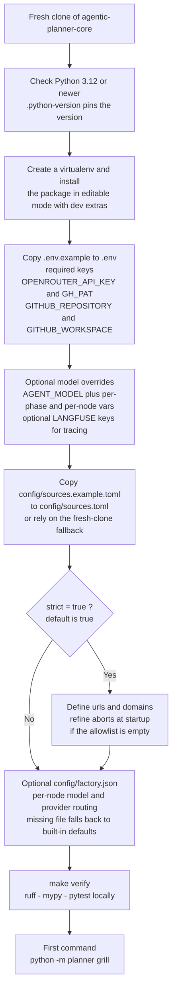

# Setup — getting the planner up

Flowchart of the setup journey: install, keys, configuration, and the first
command. The real configuration files stay untracked on your machine; the
tracked example files document their shape and double as fresh-clone fallbacks.

> **Reflects:** behavior on `main` as of 2026-09-12. Grounded in the sources
> below; where an ADR and the code disagree, this diagram follows the code and
> the mismatch is flagged under **Sources**.

## Diagram

## Notes

- `config/sources.toml` and `config/factory.json` are gitignored like `.env`
  (ADR-0024). On a fresh clone the tracked sources example file is used
  automatically with a warning; a missing factory config resolves to the
  built-in default models. `config/factory.example.json` is documentation-only
  and is never resolved at runtime — its placeholder model ids would poison
  routing.
- `GH_PAT` needs read permissions for repository contents, issues, and
  releases; it is used for the refine quota check and issue publishing.
- `strict = true` is the default and recommended posture (ADR-0002): search
  and fetch stay inside the configured `urls` and `domains`. The
  strict/allowlist pair is validated again inside every `web_search` call.
- `make verify` runs lint, format, type, and test gates locally; CI runs the
  full gate set (including semgrep, pip-audit, secret-scan, and the LLM
  judges) via the toolkit composite (ADR-0022).

## Sources

- Root README setup section: [../../README.md](../../README.md)
- Environment template: [../../.env.example](../../.env.example)
- ADR-0016 — sources config YAML → TOML:
  [../adr/0016-sources-config-yaml-to-toml.md](../adr/0016-sources-config-yaml-to-toml.md)
- ADR-0024 — forward-only secret policy and untracked config:
  [../adr/0024-forward-only-secret-policy-and-untracked-config.md](../adr/0024-forward-only-secret-policy-and-untracked-config.md)
- ADR-0002 — strict-mode source restriction:
  [../adr/0002-strict-modus-quelleneinschraenkung.md](../adr/0002-strict-modus-quelleneinschraenkung.md)
- Loader code: [../../planner/config.py](../../planner/config.py)
  (`AppConfig` fresh-clone fallback, `resolve_model_config` env → factory →
  built-in defaults)
